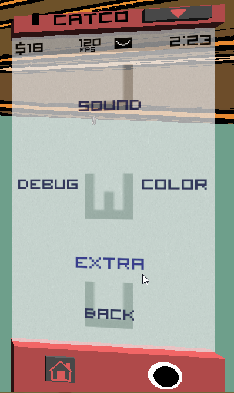
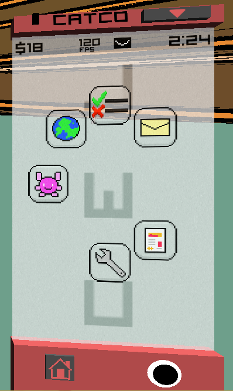
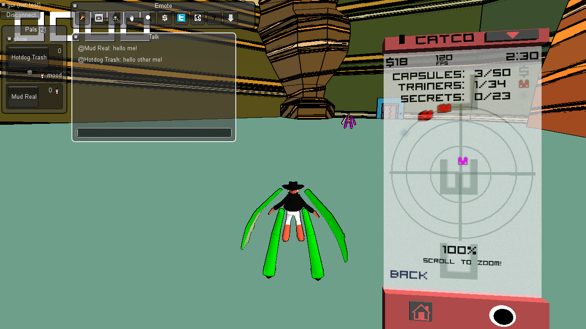
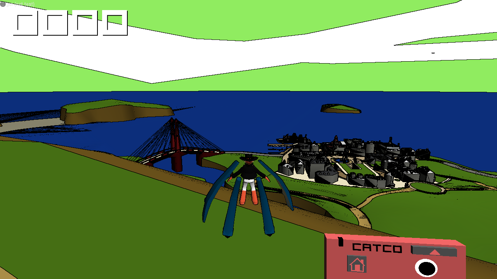
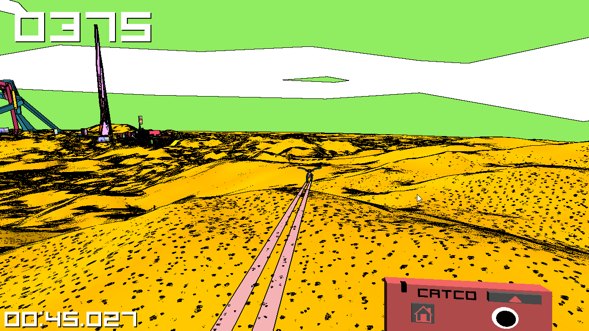

Zineth Community Edition is a fan-made mod for [Zineth](https://zinethgame-blog.tumblr.com),
a game by [Arcane Kids](https://arcanekids.com). it aims to expand upon the ideas present in the
original game, add new features, complete unfinished features, and polish the gameplay experience,
all while staying true to the games original aesthetics.

i have been working on this mod for about 2 years on and off, and i am finally ready to release it
to the public! to those of you who have been patiently waiting for this day, thank you for your support!



*a video trailer will go here when i finish editing it.*

## features so far

- trail and robot color saving

- restored multiplayer functionality

- restored update checking functionality

- players appear on the radar in multiplayer

- additional phone game monster names

- hotkey for returning back to the main menu

- ***a speedrunning mode***
  - built-in speedrunning timer
  - timer auto-stop when reaching specific goals
  - hotkey for restarting run
  - hotkey for stopping timer

- removed broken twitter integration (it will be missed...)

- improvements to custom map functionality

### here's some screenshots.

|  | |  |
|:--:|:--:|:--:|
| *a new settings page appears!* | | *so long, my old friend...* |

|  |
|:--:|
| *the pesky update checker error is no more!* |

|  |
|:--:|
| *look, it's other me, on the map!* |

|  |
|:--:|
| *custom maps! do you recognize this one?* |

|  |
|:--:|
| *just exactly how fast can you go?* |

### legacy releases

these are provided as backups of historical versions of Zineth, for convenience.

- *0.235:* [win](/files/zineth/zineth_0_235.zip) \| [mac](/files/zineth/zineth_osx_0_235.zip)
- *0.237:* [win](/files/zineth/zineth_0_237.zip) \| [mac](/files/zineth/zineth_osx_0_237.zip)
- *0.24:* [win](/files/zineth/zineth_0_24.zip) \| [mac](/files/zineth/zineth_osx_0_24.zip)

### note

this project could not have been possible without the efforts of the Arcane Kids, thank you!
this has not been officially sanctioned by them, and it almost feels out of character
to ask for permission, for some reason i just can't put my finger on.

that being said, if one of you discover this project and like it, i'd love to hear about it!

please reach out to me on [twitter](https://twitter.com/yellowberry__) or [any of my other lines](/)!